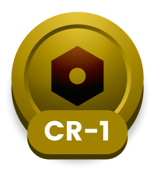
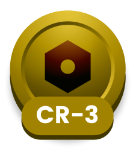
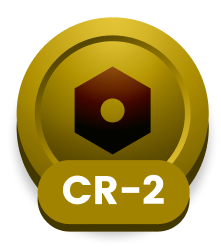
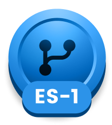
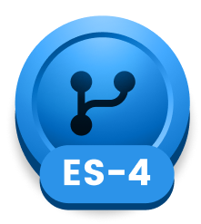

## 👋 Bem-vindo(a) ao meu repositório do desafio CarnaCode 2026!

Oi, eu sou a Mônica e este é o espaço onde compartilho minha jornada de aprendizado durante o desafio **CanraCode 2026**, realizado pelo [balta.io](https://balta.io). 🥳

Aqui você vai encontrar projetos, exercícios e códigos que estou desenvolvendo durante o desafio. O objetivo é colocar a mão na massa, testar ideias e registrar minha evolução no mundo da tecnologia.

### Sobre o desafio
O desafio **CarnaCode 2026** consiste em implementar padrões de projetos em cenários reais. Durante os 23 desafios desta jornada, os participantes são submetidos ao aprendizado e prática de:

**Creational (5)**
- Singleton
- Factory Method
- Abstract Factory
- Builder
- Prototype

**Structural (7)**
- Adapter
- Bridge
- Composite
- Decorator
- Facade
- Flyweight
- Proxy

**Behavioral (11)**
- Chain of Responsibility
- Command
- Iterator
- Mediator
- Memento
- Observer
- State
- Strategy
- Template Method
- Visitor
- Interpreter

### Recompensas

### Minhas Recompensas

### Meus Projetos

